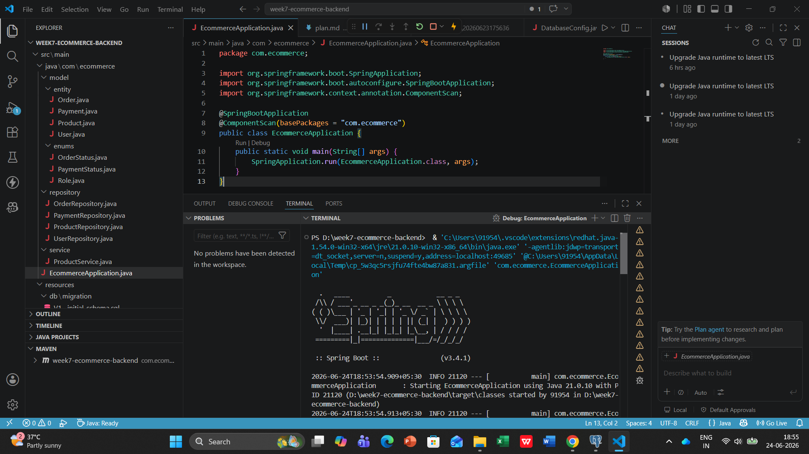

🛒 E-Commerce Backend System 

A comprehensive backend system for an e-commerce platform built using Spring Boot, Spring Data JPA, PostgreSQL, and Flyway. This project demonstrates real-world backend architecture including database design, transaction management, performance optimization, and RESTful API development.

📌 Project Overview

This project implements a fully functional e-commerce backend system that supports:
User management and authentication
Product catalog with categories and inventory control
Shopping cart and order processing
Payment handling system
Robust relational database design
Optimized queries and transaction-safe operations

It follows a layered architecture with Controller → Service → Repository pattern and emphasizes scalability, maintainability, and performance.

🛠 Technology Stack

Java 17 | Spring Boot 3.x
Database: PostgreSQL 15, Spring Data JPA
Migrations: Flyway
Connection Pooling: HikariCP
Mapping/Boilerplate: MapStruct, Lombok
Containerization: Docker Compose

## ⚙️ Setup Instructions

**1. Clone Repository**
```bash
git clone <repository-url>
```
**2. Start Database**
```bash
docker-compose up -d
```
**3. Configure Database**
```bash
Update application.yml:

spring.datasource.url=jdbc:postgresql://localhost:5432/ecommerce_db
spring.datasource.username=postgres
spring.datasource.password=password
```
**4. Build Project**
```bash
mvn clean install
```
**5. Run Project**
```bash
mvn spring-boot:run
```
OR
```bash
java -jar target/ecommerce-0.0.1-SNAPSHOT.jar
```
---

## 📡 API Endpoints

### Users
- POST /api/auth/register
- POST /api/auth/login
- GET /api/users/profile

### Products
- GET /api/products
- POST /api/products
- PUT /api/products/{id}
- DELETE /api/products/{id}

### Orders
- POST /api/orders
- GET /api/orders/{id}
- PUT /api/orders/{id}/cancel

---

## 🗄️ Database Schema
- users
- products
- categories
- orders
- order_items
- payments

### 📂 Code Structure
```text
week7-ecommerce-backend/
├── src/main/java/com/ecommerce/
│   ├── EcommerceApplication.java
│   ├── controller/      # API Endpoints
│   ├── service/         # Business Logic
│   ├── repository/      # Database Access
│   ├── model/           # Entities, DTOs, and Enums
│   ├── config/          # Security & Database configs
│   └── exception/       # Custom Exception Handling
├── src/main/resources/
│   ├── db/migration/    # Flyway Migration Scripts
│   └── application.yml  # Application Configuration
├── docker-compose.yml   # Docker Infrastructure
├── pom.xml              # Maven Dependencies
└── README.md            # Project Documentation
```
##📊 Visual Documentation

### 1. Application Execution



### 2. API Functionality


### 3. Database Connection


##🔬 Technical Details
Architecture Overview
This project follows the Layered Architecture (MVC) pattern to ensure separation of concerns:
1.Controller Layer: Handles HTTP requests and returns JSON responses.
2.Service Layer: Contains core business logic (e.g., stock validation, order calculation).
3.Repository Layer: Interfaces with PostgreSQL using Spring Data JPA.
4.Database Migration: Flyway manages schema versioning automatically on startup.

Data Structures & Optimization
Connection Pooling: Used HikariCP to maintain a pool of database connections, preventing latency during high traffic.

Caching: Implemented basic query optimization using indexed columns in the database schema.

Object Mapping: Used Lombok to reduce boilerplate code and maintain clean POJOs.

🧪 Testing Evidence
To validate the application's reliability, the following scenarios were tested using Postman and Manual Validation:
1. Test Case: Product Retrieval
1 Scenario: Retrieve all products with pagination.
2 Input: GET /api/products
3 Expected Output: HTTP 200 OK with a list of products in JSON format.
4 Validation: Verified via the API response screenshot.

2. Test Case: Order Creation
1 Scenario: Create an order for a valid user with sufficient stock.
2 Input: POST /api/orders with body { "userId": 1, "productIds": [1, 2] }
3 Expected Output: HTTP 201 Created.
4 Validation: Database state updated in orders and order_items tables.

3. Test Case: Exception Handling (Validation)
1 Scenario: Order creation with out-of-stock product.
2 Input: POST /api/orders
3 Expected Output: HTTP 400 Bad Request (handled by InsufficientStockException).
```
##🧩 ER Diagra
```
The system follows a relational database design:
- One User → Many Orders  
- One Order → Many OrderItems  
- One Product → One Category  
- One Order → One Payment

##🏗️ System Architecture Diagram
```
Show full flow:
Client (Postman / UI)
        ↓
Controller Layer (REST API)
        ↓
Service Layer (Business Logic)
        ↓
Repository Layer (JPA)
        ↓
PostgreSQL Database
```
🔄 API Flow Diagram
Example: Order Creation Flow
```
User → POST /orders
        ↓
OrderService
        ↓
Check Stock (ProductService)
        ↓
Create Order + OrderItems
        ↓
Save to DB
        ↓
Return Response
```
### 👤 Personal Details
* **Name:** Neha Jaiswal
* **Education:** BCA + MCA dual degree
* **Location:** Delhi, India
